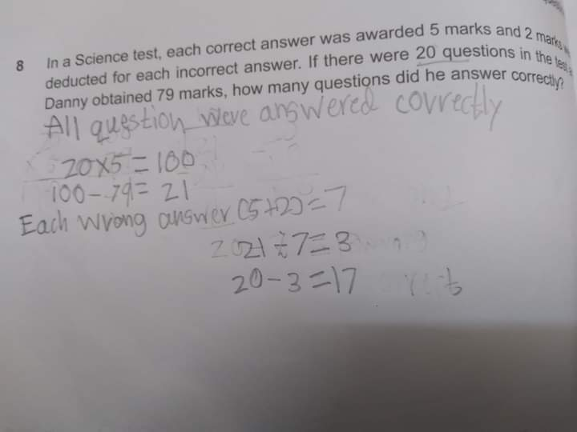

```{r setup, include=FALSE}
knitr::opts_chunk$set(echo = TRUE)
```


# Content 

1. r - base commands for Summary Statistics 
1. loading data files  
1. exercises 


## r - base commands for Summary Statistics 

```{r}
# load r-bulit-in dataset 

df <- iris

# datafile summary 
summary(df)

# mean 
mean(df$Sepal.Length)

# SD
sd(df$Sepal.Length)

# median
median(df$Sepal.Length)

# percentile 
quantile(df$Sepal.Width, 0.1)

quantile(df$Petal.Length, c(0.1, 0.9))

quantile(df$Petal.Length, seq(0, 1, by = 0.1))

# quartile
quantile(df$Petal.Length, seq(0, 1, by = 0.25))

# IQR
IQR(df$Petal.Width)

quantile(df$Petal.Width, 0.75) - quantile(df$Petal.Width, 0.25)

```


## loading data files  

```{r}
# load csv 
df <- read.csv("wnba.csv")


# excel file 
library("readxl")

df_2 <- read_excel("wnba.xlsx", sheet = "wnba") # want to learn more!

```


## exercises 

In a Science test, each correct answer was awarded 5 marks and 2 marks were deducted for each incorrect answer. If there were 20 questions in the test and Danny obtained 79 marks, how many questions did he answer correctly? 


Let assume;

+ T as total questions(or answers) 
+ C as total correct answer 
+ IC as total incorrect answer 
+ DM as Danny's total mark
+ PT as possible total marks (when all answers are correct)
+ AWD as award scale 
+ DED as deduction scale 

We can write above problem in to the following mathematics equations. 

+ $$T = C + IC$$ 
+ $$C = T - IC$$
+ $$IC = T - C$$
+ $$PT = AWD \times T$$
+ $$DM = (AWD \times C) + (DED \times IC)$$
+ $$DM = (AWD \times C + (DED \times (T - C))$$
+ $$DM = (AWD \times C) + (DED \times T) - (DED \times C)$$
+ $$DM = C(AWD - DED) + (DED \times T)$$
+ $$C = \frac{DM - (DED \times T)}{(AWD - DED)}$$


```{r}

awd <- 5
ded <- -2
t <- 20
dm <- 79

c <- (dm - (ded * t))/(awd - ded)
c

```


Compare with below method and any comment?

```{r echo=FALSE, out.width = "80%", fig.align = "center"}



```

